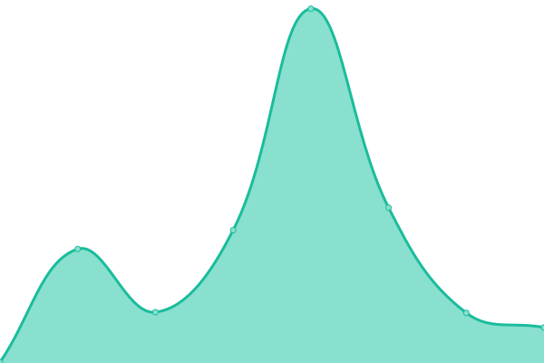

# [📈 Live Status](https://status.monobank.com): <!--live status--> **🟧 Partial outage**

This repository contains the open-source uptime monitor and status page for [monobank.com](https://monobank.com/), powered by [Upptime](https://github.com/upptime/upptime).

With [Upptime](https://upptime.js.org), you can get your own unlimited and free uptime monitor and status page, powered entirely by a GitHub repository. We use [Issues](https://github.com/monobankcom/upptime/issues) as incident reports, [Actions](https://github.com/monobankcom/upptime/actions) as uptime monitors, and [Pages](https://status.monobank.com) for the status page.

<!--start: status pages-->
<!-- This summary is generated by Upptime (https://github.com/upptime/upptime) -->
<!-- Do not edit this manually, your changes will be overwritten -->
<!-- prettier-ignore -->
| URL | Status | History | Response Time | Uptime |
| --- | ------ | ------- | ------------- | ------ |
|  [monobank.com](https://monobank.com) | 🟩 Up | [monobank-com.yml](https://github.com/monobankcom/upptime/commits/HEAD/history/monobank-com.yml) | 

 192ms
     
 | 

<a href="https://status.monobank.com/history/monobank-com">100.00%</a>
    

|  [monobank App](https://app.monobank.com) | 🟥 Down | [monobank-app.yml](https://github.com/monobankcom/upptime/commits/HEAD/history/monobank-app.yml) | 

 127ms
     
 | 

<a href="https://status.monobank.com/history/monobank-app">0.06%</a>
    

|  [monobank India](https://monobank.in) | 🟥 Down | [monobank-india.yml](https://github.com/monobankcom/upptime/commits/HEAD/history/monobank-india.yml) | 

 109ms
     
 | 

<a href="https://status.monobank.com/history/monobank-india">0.06%</a>
    

|  [Quote API](https://api.cow.fi/mainnet/api/v1/quote) | 🟩 Up | [quote-api.yml](https://github.com/monobankcom/upptime/commits/HEAD/history/quote-api.yml) | 

 3662ms
     
 | 

<a href="https://status.monobank.com/history/quote-api">100.00%</a>
    

<!--end: status pages-->

[**Visit our status website →**](https://status.monobank.com)

## 📄 License

- Powered by: [Upptime](https://github.com/upptime/upptime)
- Code: [MIT](./LICENSE) © [monobank.com](https://monobank.com/)
- Data in the `./history` directory: [Open Database License](https://opendatacommons.org/licenses/odbl/1-0/)
